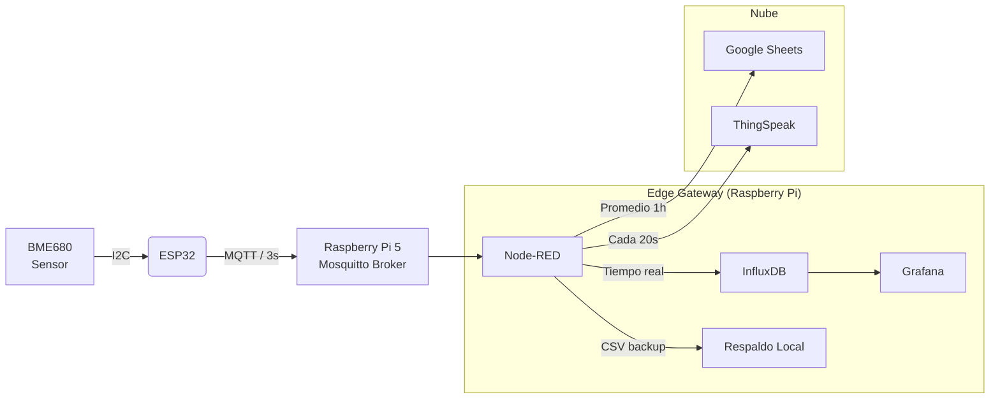

# 🌦️ Estación Meteorológica IoT v5.0.7-MQTT (MQTT + Edge Computing)

---

## 🆕 Novedades (v5.0)

- 🔄 **Auto-Rollback OTA (Fail-Safe):** tras una actualización, el firmware se confirma como válido (`esp_ota_mark_app_valid_cancel_rollback`) cuando arranca correctamente con Wi-Fi; si la conexión agota reintentos, marca la imagen como inválida y vuelve a la partición funcional anterior (`esp_ota_mark_app_invalid_rollback_and_reboot`).

## 🆕 Novedades (v4.3.4.1)

- 🔐 On-demand Basic Auth: la interfaz de lectura es pública; el modal de login solo se solicita cuando se ejecutan acciones administrativas (guardar configuración, guardar WiFi, subir firmware OTA, descargar logs). Al introducir credenciales válidas, la acción solicitada se reintenta automáticamente.
- 📄 Descarga de logs corregida: `/downloadLog` ahora exige autenticación para acciones administrativas y sirve `/error.log` con `Content-Disposition` para forzar descarga; el frontend descarga el archivo como Blob para compatibilidad con navegadores.
- 📡 Escaneo Wi‑Fi asíncrono: `/api/wifi/scan` comprueba `WiFi.scanComplete()` y inicia `WiFi.scanNetworks(true)` cuando sea necesario, devolviendo `[]` mientras se completa el escaneo y los resultados cuando estén disponibles.
- 💡 Feedback visual más rápido: se acortaron los intervalos de parpadeo del LED para una retroalimentación visual más inmediata.
- 🛠️ Version bump: firmware marcado como `v4.3.4.1-MQTT`.

---

## 🆕 Novedades (v4.2.0)

- 🔋 Monitoreo de batería: se incorpora un módulo de medición de voltaje que expone `battery_voltage` y `battery_status` en la API (`/sensor_data`) y en la interfaz web. Permite detectar batería ausente, undervoltage y estado OK.
- 🔁 Registro de motivo de reinicio: al iniciar, el firmware registra `esp_reset_reason` (Watchdog, Brownout, Panic, etc.) en el log para facilitar diagnóstico de problemas de alimentación o WDT.
- 🧰 Reducción de escrituras NVS (throttling): el guardado del estado BSEC en NVS ahora respeta un cooldown de 15 minutos entre escrituras exitosas para evitar escrituras redundantes y prolongar la vida de la memoria Flash.
- 🛡️ Robustez UI: el frontend ahora valida y captura errores JSON/SSE evitando que respuestas malformadas detengan las actualizaciones de la interfaz.
- 🎨 UI offline: se embebió CSS crítico en la web UI para que el panel conserve estilos aun sin conexión a CDNs.

---

## 🏗️ Arquitectura del Sistema

El sistema utiliza un patrón de **Edge Gateway**. El ESP32 se dedica exclusivamente a la lectura precisa del sensor y transmisión rápida, mientras que la Raspberry Pi gestiona la lógica de negocio, almacenamiento y visualización.

---

<!-- Simple "cards" styled with inline CSS (renders on GitHub pages/README) -->

  

    <h3 style="margin:0 0 8px 0">Firmware ESP32</h3>
    <ul style="margin:0 0 0 16px;padding:0">
      <li>Algoritmo BSEC (Bosch) — IAQ y calibración persistente (NVS).</li>
      <li>Monitoreo de batería y reporte de voltaje/estado al frontend.</li>
      <li>Persistencia NVS con throttling (cooldown 15 min) para proteger la Flash.</li>
      <li>Interfaz web de configuración embebida + OTA.</li>
    </ul>
  

  

    <h3 style="margin:0 0 8px 0">Backend (Raspberry Pi / Node-RED)</h3>
    <ul style="margin:0 0 0 16px;padding:0">
      <li>Node-RED: procesamiento y ruteo.</li>
      <li>InfluxDB: serie temporal, retención configurable.</li>
      <li>Grafana: dashboards en tiempo real (3s).</li>
      <li>Integraciones: Google Sheets (promedios), ThingSpeak.</li>
    </ul>
  

  

    <h3 style="margin:0 0 8px 0">Respaldo & Escalabilidad</h3>
    <ul style="margin:0 0 0 16px;padding:0">
      <li>CSV local por Node-RED para recuperación offline.</li>
      <li>Multi-dispositivo: separación por etiqueta <code>location</code>.</li>
      <li>Rate limits: ThingSpeak / Google Sheets — agregación en Node-RED.</li>
    </ul>
  

---

## 🛠️ Hardware Requerido (tabla)

| Componente | Modelo recomendado | Notas |
|---|---|---|
| Sensor | Bosch BME680 | Temperatura / Humedad / Presión / Gas (VOCs) |
| MCU | ESP32 (DevKit V1) | Soporta BSEC, OTA y Web UI |
| Gateway | Raspberry Pi 4/5 | Ejecuta Mosquitto, Node-RED, InfluxDB, Grafana |
| Alimentación | Fuente 5V/2A | Depende del caso de uso y sensores adicionales |
| Carcasa | IP65 opcional | Para instalación exterior |

---

## 🚀 Instalación y Configuración (resumen)

1. Plataforma: PlatformIO en VS Code.  
2. Verifica platformio.ini (ej. `lib_archive = no` para BSEC).  
3. Compilar con `pio run -e esp32doit-devkit-v1` y flashear el bin (`.pio/build/esp32doit-devkit-v1/firmware.bin`).  
4. Subir firmware y la imagen SPIFFS/LittleFS para la Web UI.  
5. Configurar WiFi/MQTT/ThingSpeak desde la UI del dispositivo.

**Servidor (Raspberry Pi)**  
- Mosquitto (broker MQTT)  
- Node-RED (flows incluidos en `nodered_flow.json`)  
- InfluxDB + Grafana (datasource apuntando a DB `sensores`)

---

## ⚙️ Configuración (config.json)

Las claves principales (además de las usuales) disponibles en `config.json` son:

| Clave | Tipo | Descripción |
|---|---|---|
| location | string | Identificador legible de la ubicación del sensor |
| altitude | float | Altitud en metros para calibraciones |
| mqttServer | string | Host o IP del broker MQTT |
| mqttPort | int | Puerto MQTT (default 1883) |
| mqttUser | string | Usuario MQTT |
| mqttPassword | string | Contraseña MQTT |
| mqttTopic | string | Tópico base para publicación |
| vbatPin | int | Pin ADC para lectura de batería (ej. 35) |
| vdivRatio | float | Ratio del divisor de tensión (ej. 2.0) |
| voltageThreshold | float | Voltaje umbral para alertas (V) |
| voltageCheckIntervalMs | int | Intervalo de chequeo del voltaje (ms) |
| minDetectVoltage | float | Voltaje mínimo detectado por el ADC (V) |
| updateOta | int | Intervalo OTA en horas |

> Nota: Las claves de voltaje son opcionales y tienen valores por defecto en el firmware. Ajusta `vdivRatio` y `vbatPin` según tu montaje.

---

## 📊 Estructura de Datos (InfluxDB)

Los datos se guardan en la base `sensores`, measurement `clima`.

| Campo | Tipo | Descripción |
|---|---:|---|
| temperature | Float | Temperatura compensada (°C) |
| humidity | Float | Humedad relativa (%) |
| pressure | Float | Presión atmosférica (hPa) |
| iaq | Float | Índice de Calidad de Aire (0-500) |
| iaq_accuracy | Int | Precisión (0=Estabilizando, 3=Calibrado) |
| gas_resistance | Float | Resistencia del sensor (Ohms) |
| battery_voltage | Float | Voltaje medido de la batería (V) — v4.2.0 |
| battery_status | String | Estado de batería: absent / undervoltage / ok |

**Tags:** `location`, `device_id`

---

## ☁️ Integración Google Sheets

- Node-RED acumula lecturas durante 60 minutos y envía el promedio horario al script de Google Apps (Esp32.gs).  
- ThingSpeak recibe lecturas cada 20s (respetando límites de la API).

---

## 🧾 Notas de mantenimiento y diagnóstico

- Al arrancar el firmware se escribe en el log (SPIFFS) el motivo del último reinicio (`esp_reset_reason`) para facilitar auditoría de reinicios por WDT, brownout o pánicos.
- El mecanismo de persistencia BSEC (NVS) implementa un cooldown de 15 minutos entre escrituras exitosas para evitar desgaste de la memoria flash.
- Si necesitas forzar la recarga del estado BSEC o depurar la NVS, revisa las trazas serie y el archivo de log en `/error.log` dentro del SPIFFS.

---

## 📜 Licencia

Este proyecto es open-source bajo la licencia AGPL-3.0.  
Desarrollado por JesPezz.

