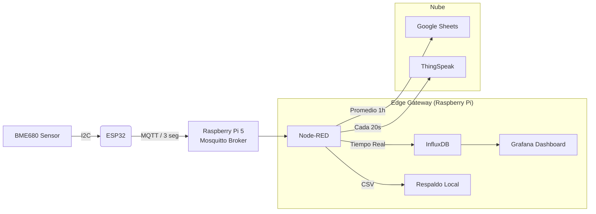

# 🌦️ Estación Meteorológica IoT v4.0 (MQTT + Edge Computing)

Este proyecto implementa un sistema de monitoreo ambiental profesional basado en el sensor **BME680** y el microcontrolador **ESP32**. A diferencia de las versiones anteriores, la **v4.0** migra de[...] 

---

## 🏗️ Arquitectura del Sistema

El sistema utiliza un patrón de **Edge Gateway**. El ESP32 se dedica exclusivamente a la lectura precisa del sensor y transmisión rápida, mientras que la Raspberry Pi gestiona la lógica de neg[...] 

## Características Principales

### Firmware ESP32

- Algoritmo BSEC: Integración de la librería propietaria de Bosch (v1.4.8.0) para el cálculo preciso de IAQ (Índice de Calidad de Aire).
- Comunicación asíncrona: Uso de AsyncMqttClient para envíos no bloqueantes.
- Persistencia de calibración: Guarda el estado del sensor en memoria NVS (bsec_clean) para recuperar la precisión tras reinicios.
- Interfaz web integrada: Configuración de WiFi, MQTT y credenciales sin recompilar.
- OTA (Over-The-Air): Actualización de firmware vía WiFi.

### 🧠 Backend (Raspberry Pi / Node-RED)

- Visualización en tiempo real: Gráficas en Grafana con resolución de 3 segundos.
- Optimización de datos:
  - Google Sheets: Recibe un promedio horario para ahorrar celdas.
  - ThingSpeak: Recibe datos cada 20s (Rate Limit) para evitar bloqueos.
- Multi-dispositivo: Soporte para múltiples ESP32 simultáneos separados por la etiqueta `location`.

🛠️ Hardware Requerido
Sensor: Bosch BME680 (Temperatura, Humedad, Presión, Gas/VOCs).

Microcontrolador: ESP32 (DevKit V1 recomendado).

Gateway: Raspberry Pi 4 o 5 (corriendo Raspberry Pi OS).

🚀 Instalación y Configuración
1. Firmware ESP32 (PlatformIO)
Este proyecto está diseñado para PlatformIO en VS Code.

Clonar el repositorio.

Abrir la carpeta en VS Code.

Verificar platformio.ini (asegurar lib_archive = false para BSEC).

Compilar y subir el código al ESP32.

Subir la imagen del sistema de archivos (Upload Filesystem Image) para la interfaz web.

Configuración Inicial:

Conectarse al Punto de Acceso WiFi del ESP32 (si no hay redes guardadas).

Ingresar a 192.168.4.1 (o la IP asignada por el router).

Configurar:

WiFi: SSID y Contraseña.

MQTT: IP de la Raspberry Pi, Puerto (1883), Usuario/Pass.

ThingSpeak: API Key y Channel ID (opcional).

2. Configuración del Servidor (Raspberry Pi)
Se requiere instalar el siguiente stack de software:

# 1. Broker MQTT
sudo apt install mosquitto mosquitto-clients

# 2. Node-RED
bash <(curl -sL [https://raw.githubusercontent.com/node-red/linux-installers/master/deb/update-nodejs-and-nodered](https://raw.githubusercontent.com/node-red/linux-installers/master/deb/update-nod[...]

# 3. InfluxDB y Grafana
# (Seguir instrucciones oficiales de sus respectivos repositorios apt)

Despliegue de Lógica:

Importar el archivo nodered_flow.json (incluido en este repo) dentro de Node-RED.

Configurar las credenciales de MQTT y la URL del Google Script en los nodos correspondientes.

Configurar el Data Source en Grafana apuntando a la base de datos sensores de InfluxDB.

📊 Estructura de Datos (InfluxDB)
Los datos se almacenan en la base de datos sensores, measurement clima.

Campo,Tipo,Descripción
temperature,Float,Temperatura compensada (°C)
humidity,Float,Humedad relativa (%)
pressure,Float,Presión atmosférica (hPa)
iaq,Float,Índice de Calidad de Aire (0-500)
iaq_accuracy,Int,"Precisión de calibración (0=Estabilizando, 3=Calibrado)"
gas_resistance,Float,Resistencia del sensor de gas (Ohms)

Etiquetas (Tags):

location: Ubicación definida en el ESP32 (ej: "Sala", "Patio").

device_id: Dirección MAC del dispositivo.

☁️ Integración Google Sheets
El sistema envía un resumen horario al script de Google Apps (Esp32.gs).

Lógica: Node-RED acumula lecturas durante 60 minutos.

Disparo: Al minuto :00 de cada hora。

Datos: Promedio aritmético de valores analógicos + último estado conocido de valores discretos.

📜 Licencia
Este proyecto es de código abierto bajo la licencia MIT.

Desarrollado por JesPezz.
