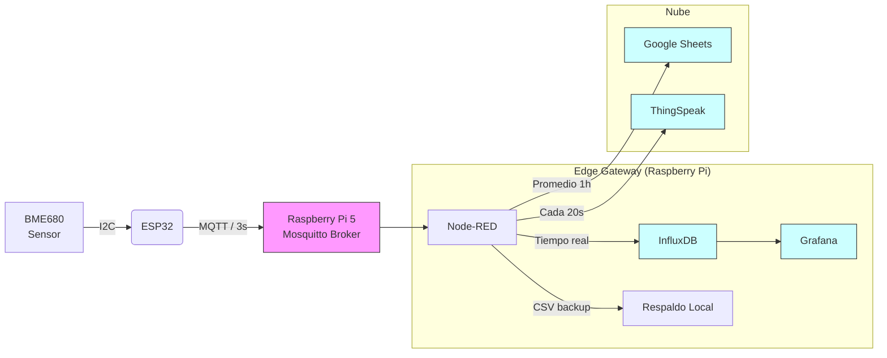

# 🌦️ Estación Meteorológica IoT v4.0 (MQTT + Edge Computing)

---

## 🏗️ Arquitectura del Sistema

El sistema utiliza un patrón de **Edge Gateway**. El ESP32 se dedica exclusivamente a la lectura precisa del sensor y transmisión rápida, mientras que la Raspberry Pi gestiona la lógica de negocio, almacenamiento y visualización.

---

<!-- Simple "cards" styled with inline CSS (renders on GitHub pages/README) -->

  

    <h3 style="margin:0 0 8px 0">Firmware ESP32</h3>
    <ul style="margin:0 0 0 16px;padding:0">
      <li>Algoritmo BSEC (Bosch) v1.4.8.0 — IAQ.</li>
      <li>AsyncMqttClient — comunicaciones no bloqueantes.</li>
      <li>Persistencia NVS (bsec_clean) para calibración.</li>
      <li>Interfaz web de configuración + OTA.</li>
    </ul>
  

  

    <h3 style="margin:0 0 8px 0">Backend (Raspberry Pi / Node-RED)</h3>
    <ul style="margin:0 0 0 16px;padding:0">
      <li>Node-RED: procesamiento y ruteo.</li>
      <li>InfluxDB: serie temporal, retención configurable.</li>
      <li>Grafana: dashboards en tiempo real (3s).</li>
      <li>Integraciones: Google Sheets (promedios), ThingSpeak.</li>
    </ul>
  

  

    <h3 style="margin:0 0 8px 0">Respaldo & Escalabilidad</h3>
    <ul style="margin:0 0 0 16px;padding:0">
      <li>CSV local por Node-RED para recuperación offline.</li>
      <li>Multi-dispositivo: separación por etiqueta <code>location</code>.</li>
      <li>Rate limits: ThingSpeak / Google Sheets — agregación en Node-RED.</li>
    </ul>
  

---

## 🛠️ Hardware Requerido (tabla)

| Componente | Modelo recomendado | Notas |
|---|---|---|
| Sensor | Bosch BME680 | Temperatura / Humedad / Presión / Gas (VOCs) |
| MCU | ESP32 (DevKit V1) | Soporta BSEC, OTA y Web UI |
| Gateway | Raspberry Pi 4/5 | Ejecuta Mosquitto, Node-RED, InfluxDB, Grafana |
| Alimentación | Fuente 5V/2A | Depende del caso de uso y sensores adicionales |
| Carcasa | IP65 opcional | Para instalación exterior |

---

## 🚀 Instalación y Configuración (resumen)

1. Plataforma: PlatformIO en VS Code.  
2. Verifica platformio.ini (ej. `lib_archive = false` para BSEC).  
3. Subir firmware (include SPIFFS/LittleFS image para Web UI).  
4. Configurar WiFi/MQTT/ThingSpeak desde la UI del dispositivo.

**Servidor (Raspberry Pi)**  
- Mosquitto (broker MQTT)  
- Node-RED (flows incluidos en `nodered_flow.json`)  
- InfluxDB + Grafana (datasource apuntando a DB `sensores`)

---

## 📊 Estructura de Datos (InfluxDB)

Los datos se guardan en la base `sensores`, measurement `clima`.

| Campo | Tipo | Descripción |
|---|---:|---|
| temperature | Float | Temperatura compensada (°C) |
| humidity | Float | Humedad relativa (%) |
| pressure | Float | Presión atmosférica (hPa) |
| iaq | Float | Índice de Calidad de Aire (0-500) |
| iaq_accuracy | Int | Precisión (0=Estabilizando, 3=Calibrado) |
| gas_resistance | Float | Resistencia del sensor (Ohms) |

**Tags:** `location`, `device_id`

---

## ☁️ Integración Google Sheets

- Node-RED acumula lecturas durante 60 minutos y envía el promedio horario al script de Google Apps (Esp32.gs).  
- ThingSpeak recibe lecturas cada 20s (respetando límites de la API).

---

## 📜 Licencia

Este proyecto es open-source bajo la licencia AGPL-3.0.  
Desarrollado por JesPezz.
